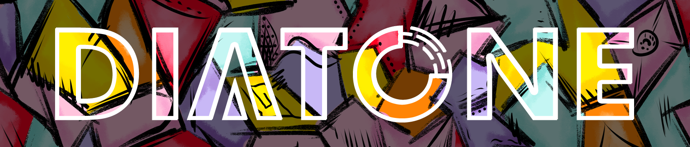
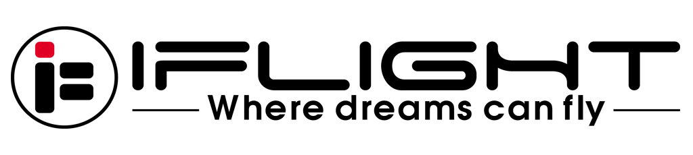

# BF wiki 中文站

## 欢迎来到Betaflight Wiki中文站！

本站全部内容均在GitHub以markdown文本形式，在GPL3.0下开源发布。项目地址[在这里](https://github.com/AirFleetTeam/BF-wiki-in-Chinese)，欢迎贡献。

### 为什么

设立本站的目的是：

* 破除语言障碍，自由学习并探索Betaflight的内在原理
* 寻找潜在的优质贡献者
* 防止诸位中文玩家迷路

**强烈建议您收藏本站！**

### 使用指南

右上角有搜索框，您可以使用搜索框来搜索您感兴趣的内容。

如果某个内容在官方wiki上有而在这里没有：

* 该篇中文wiki正在调整排版马上发布，可以移步AirFleet公众号查看
* 该篇wiki过于陈旧，已不具有任何参考价值
* 该篇wiki尚未翻译完成

### 贡献与维护

本站由Betaflight翻译团队成员市民姜先生（[DusKing1](https://github.com/DusKing1)）及Pitronic（[PitronicTeam](https://github.com/pitronicteam)）维护，并得到了Betaflight核心团队的支持。欢迎关注微信公众号Pitronic，旨在帮助有能力的中文玩家成为“大神”，商业合作请后台留言。

本站的大部分内容的初稿都是由市民姜先生独立完成的，如果您很欣赏他的能力，并觉得他的翻译工作对您有帮助，请考虑打赏以支持其工作。

部分译文参考自SmartFOX。

### 赞助商

感谢我们的赞助商为我们提供的工作动力。更多信息请访问[赞助商页面](zan-zhu-shang.md)。

         

想成为本站赞助商？微信公众号后台留言即可。

