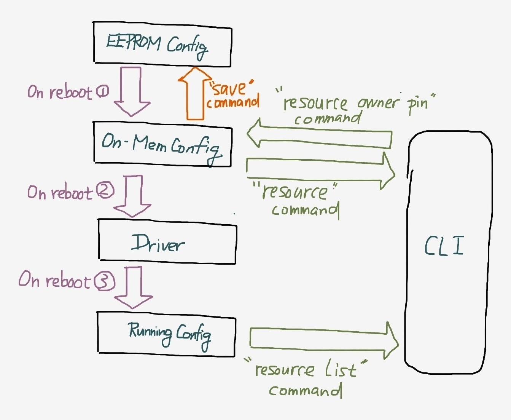

# 资源重新映射

**注意：此命令仅在3.1及更高版本的Betaflight中可用。**

IO重映射使您可以配置MCU上的引脚，以将其用于各种功能。这只是一个初始框架 - 它可以完成更多工作。

使用CLI命令resource重新映射引脚。

`resource [function name] [index] [pin]` （例如`resource MOTOR 1 A1`）

其中MOTOR是函数名（function name），1是电机标签索引（index）（从1开始，例如，四轴飞行器上的1-4），A1是端口A的引脚（pin）1，或者更常见的叫法是遵循STM数据手册，引脚PA1。

要删除映射，请在PIN位置上使用`NONE`来代替，例如`resource MOTOR 5 NONE`

如果某个功能不需要使用INDEX（例如它只有唯一一种引脚分配），例如`BEEPER`，`SONAR_ECHO`或者`SONAR_TRIGGER`，那么INDEX**必须**为空（例如resource BEEPER B6）。

`resource`将列出所有可用的可配置选项及其当前映射。输出结果将添加到dump输出结果中，用于备份和还原配置。注意，此命令将列出所有已配置的资源。

例如，resource将显示电机1-8，但如果您的混控器设置为QuadX，则实际上仅会使用电机1-4。如果您将混控器改为Oct，然后重新启动飞控，则将会使用所有8个电机。

`resource list`将列出所有引脚及其当前映射，包括系统组件正在使用且用户**无法**配置的所有引脚。它还将列出当前实时的DMA使用率。请注意，所做的任何调整都需要保存并重新启动，以便在此处看到这些更改。应将此命令视为当前活动状态的输出情况。

请注意，通过CLI更改引脚映射后，必须使用`save`命令保存并重启。

### 可用功能、值及对应约束条件

| 功能 | 值 | 描述 | 约束条件 |
| :--- | :--- | :--- | :--- |
| ADC\_BATT | -- | 电池电压传感器 | 只能映射到其他ADC引脚 |
| ADC\_CURR | -- | 电池电流传感器 | 只能映射到其他ADC引脚 |
| ADC\_RSSI | -- | 接收机的模拟RSSI输入 | 只能映射到其他ADC引脚 |
| BEEPER | -- | 信号蜂鸣器 | 通常直接接至蜂鸣器晶体管的基极 |
| CAMERA\_CONTROL | -- | FPV摄像头由OSD控制 | 由摇杆模拟按钮。直接接线并需要外接电容/电阻，因此现有的CAMERA\_CONTROL尽可用于某些低频应用中，例如SmartAudio |
| ESCSERIAL | ？ | ？ | ？ |
| I2C\_SCL | 1-n |  |  |
| I2C\_SDA | 1-n |  |  |
| INVERTER |  |  |  |
| LED | 1-3 | LED指示灯 | 请勿与LED\_STRIP混淆 |
| LED\_STRIP | -- | WS2812 LED数据 | 如果未连接/未使用WS2812，LED是很好的替代选项 |
| MOTOR | 1-n | 电机信号 | 电机引脚之间的映射交换应正常工作。使用其他引脚则可能不起作用（DMA与Dshot冲突）。 |
| PPM | -- | 接收机PPM输入 | 是可选功能的良好选项 |
| PWM | 1-n | 接收机PWM输入 | ？ |
| SERIAL\_RX | 1-n | 串行接收引脚 | 无法重映射到其他引脚，但可以指定不同的功能（参阅软件串行端口） |
| SERIAL\_TX | 1-n | 串行发送引脚 | SERIAL\_RX/SERIAL\_TX 11-12 是软串口\#1和\#2 |
| SERVO | 1-n | 舵机信号 | ？ |
| SONAR\_ECHO | -- |  |  |
| SONAR\_TRIGGER | -- |  |  |
| SPI\_MISO | 1-n |  |  |
| SPI\_MOSI | 1-n |  |  |
| SPI\_SCK | 1-n |  |  |

### 包含使用resource命令的示例的Wiki页面：

* 重新映射电机
* 使用舵机&舵机云台
* 使用通道转发
* 固定翼飞机的设置

