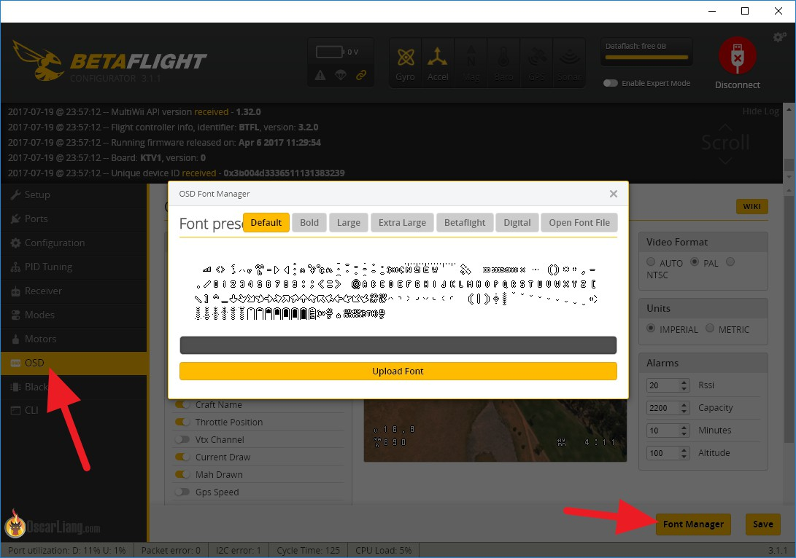

# OSD字体上传问题

**无法更改OSD字体？**

### 描述

通过Betaflight配置程序字体上传功能在某些飞控板上似乎不起作用。

 

无论您上传字体多少次，OSD仍显示默认字体。

### 解决方案

您需要插入电池，以使该功能正常工作（请一定要移除螺旋桨！）。先插入电池，然后连接USB。

### 最可能的原因

当仅连接USB时，某些飞控板无法为OSD芯片正确供电（或者根本无法供电）。OSD字体存储在OSD芯片内部，因此必须通电，并与飞控板的其余部分通信，这样才能更新字体。

### 相关飞控板

已知下列飞控存在字体上传问题

| 飞控板名称                      | 飞控目标名         | OSD芯片 | 插入电池就能解决这个问题吗？ | 产品网址                                                                                                                                                   |
| -------------------------- | ------------- | ----- | -------------- | ------------------------------------------------------------------------------------------------------------------------------------------------------ |
| DAL RC F405 AIO            | DALRCF405     | 不适用   | 是              | [dalrc](http://www.dalrc.cn/DALRC/plus/view.php?aid=186)                                                                                               |
| DAL RC F722Dual            | DALRCF722DUAL | 不适用   | 是              |                                                                                                                                                        |
| Diatone Mamba F405 Mini FC | FURYF4OSD     | 不适用   | 是              | [diatone](https://www.diatoneusa.com/store/p574/MAMBA_F405\_Mini_Betaflight_Flight_Controller_F25\_25A\_2\_4S_DSHOT600\_FPV_Racing_Brushless_ESC.html) |

### 资源

[参考链接](https://github.com/betaflight/betaflight-configurator/issues/1301)
