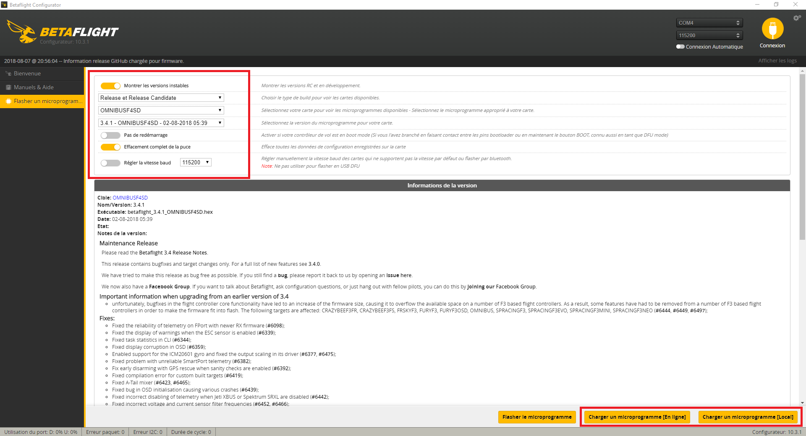

# 安装Betaflight

## 如何在飞控上安装Betaflight固件

使用Betaflight配置程序，选择“固件烧写工具”选项卡，然后选择以两种不同方式（在线或本地固件）中的一种进行刷新。

1. 加载在线固件。 选择左上角的飞控目标和版本。按屏幕右下方的“从网络加载固件”。
2. 加载本地固件。 按下“从本地电脑加载固件”按钮，您现在可以浏览含有Betaflight固件文件的文件夹。选择与您的飞行控制器匹配的正确固件。      不点选任何选项（默认）并按下“烧写固件”。配置程序工具将擦除飞控芯片，并会将所选固件刷写到您的飞控中。以上操作都假定您已安装了正确的驱动程序，请继续阅读以获取详细信息。

所有的飞控基本上都使用两种USB设备：

1. 使用Silabs CP2103 USB芯片。 需要安装Silabs CP210x驱动程序。用于Bootloader模式下刷写固件和普通配置模式。在BF配置程序中显示为“COMx”设备。 [http://www.silabs.com/products/development-tools/software/usb-to-uart-bridge-vcp-drivers](http://www.silabs.com/products/development-tools/software/usb-to-uart-bridge-vcp-drivers)
2. 使用MCU集成的STM32 VCP USB接口。 2.1.在Bootloader模式下需要使用WinUSB驱动进行固件烧录。可以由Zadig或ImpulseRC DFU工具进行安装。在BF配置程序中将显示为“DFU”设备。 2.2.需要STM VCP驱动程序来与BF配置程序进行连接预配置，在BF配置程序中显示为“COMx”设备。
3. CC3D是一个特例。 它是使用第二种USB设备的飞控，但由于其是基于STM32F1芯片的飞控，因此缺少2.1的DFU接口。所有基于F1的飞控仅具有基于串行UART的Bootloader接口。CC3D需要在UART1上使用外部USB串行适配器来进入Bootloader模式刷写固件和连接配置程序。（或烧录辅助Bootloader，比如OP自己的Bootloader。）

基于原生USB接口的飞控

请注意，此章节仅针对那些不使用硬件串行适配器的飞控 - 例如FTDI或Silabs CP210x。

可以使用这个方便的工具修复驱动程序问题： [https](https://impulserc.blob.core.windows.net/utilities/ImpulseRC_Driver_Fixer.exe) : [//impulserc.blob.core.windows.net/utilities/ImpulseRC\_Driver\_Fixer.exe](https://impulserc.blob.core.windows.net/utilities/ImpulseRC_Driver_Fixer.exe)

它需要使用.NET框架V4.5。可以在这里下载： [https](https://www.microsoft.com/en-au/download/details.aspx?id=30653) : [//www.microsoft.com/zh-cn/download/details.aspx?id=30653](https://www.microsoft.com/en-au/download/details.aspx?id=30653)

如果您在连接至飞控时出现问题：  

### Windows下使用DFU模式进行固件烧录 - USB DFU

如果您使用Windows系统，并需要使用DFU来启动Bootloader模式，请确保您有Zadig工具。说明如下：

1. 下载Zadig：[ http://zadig.akeo.ie/](../)
2. 将设备置于DFU模式。如果这是第一次烧写Betaflight，则需要在插入USB之前短路BL或Boot（或按住BOOT按钮）。
3. 打开Zadig。
4. 选项 -&gt; 列出所有设备。
5. 单击下拉框，然后单击列出的设备STM32 BOOTLOADER    
6. 在绿色箭头右侧的框中，选择WinUSB（v6.1.7600.16385）
7. 单击安装驱动程序。
8. 安装完成后，重新启动计算机（在重启这一点上，您可以作弊，只需要确保浏览器重启，但这样并不能保证其仍能正常工作）。如果重启期间USB电源仍然有输出，飞控应保持在DFU模式下。如果重启导致USB断电，请再次执行步骤2。
9. 打开Betaflight配置程序。
10. 转到“固件烧录工具”页面，选择“无重启序列”。
11. 在F4飞控上，禁用“全盘擦除”。烧录完成后可以在配置器中使用“重置为默认值”。
12. 点击“从本地电脑加载固件”。
13. 浏览并选择适当的固件。
14. 单击“烧录固件”。
15. 飞控板指示灯应该开始闪烁。配置程序底部进度条首先指示擦除，然后是烧录，最后是验证。
16. 烧录完成后，您的飞控将重新启动，但是您可能需要安装STM VCP驱动程序（请参见下文）以使Betaflight配置程序与飞控通信。

### 在Windows下安装STMicro虚拟串口（VCP）驱动程序

许多F7，F4（REVO，ALIENFLIGHTF4，BLUEJAYF4等）和某些F3飞控（SPRacingFEVO，STM32DISCOVERY）都是用STM32虚拟串口（VCP） - CDC 串行方式。这样可以在连接USB的同时，使用飞控板上的UART。这要求安装STM VCP驱动程序，以便电脑将VCP识别为飞控板上的附加通讯端口。**注意**：这与安装USB串行驱动程序，例如FTDI或Silabs CP210x，相类似。

可以在这里下载STM32 VCP驱动程序：[http://www.st.com/web/zh/catalog/tools/PF257938](http://www.st.com/web/zh/catalog/tools/PF257938)

**注意**：下载并安装之后，它并没有安装驱动程序，只是解压缩了所选择的驱动程序。请找到安装目录，然后运行与您系统位数相符的EXE文件。

例如`C:\Program Files (x86)\STMicroelectronics\Software\Virtual comport driver\Win8\`这里会显示两个文件。一个用于64位系统`dpinst_amd64.exe`，一个用于32位系统`dpinst_x86.exe`。

### Windows 10

许多情况下，上述操作可能无效。从Silabs安装虚拟COM端口驱动程序将解决这些问题： [https://www.silabs.com/products/development-tools/software/usb-to-uart-bridge-vcp-drivers](https://www.silabs.com/products/development-tools/software/usb-to-uart-bridge-vcp-drivers)

### 特定平台：Linux

Linux并没有特定于某个产品的“设备驱动程序”的概念，因此不需要安装驱动程序。但是若要使Betaflight配置程序在Linux上工作，需要执行下面几个步骤：

Linux需要udev规则，以允许用于对USB设备进行写入访问。如果您不熟悉udev规则，请放心，我们将使用命令行（CLI）界面逐步知道您完成该过程。

**第一步**：

由于我们将使用CLI，因此只需将此命令复制并粘贴到您的中断中，它将为您创建所需的文件：

`(echo '# DFU (Internal bootloader for STM32 MCUs)'    
echo 'ACTION=="add", SUBSYSTEM=="usb", ATTRS{idVendor}=="0483", ATTRS{idProduct}=="df11", MODE="0664", GROUP="plugdev"') | sudo tee /etc/udev/rules.d/45-stdfu-permissions.rules > /dev/null`

创建的文件是`/etc/udev/rules.d/45-stdfu-permissions.rules`，当飞控处于DFU模式时使用。

**第二步**：

确保您有可以以飞DFU模式访问飞控的权限（请参考：[https://github.com/GoldenCheetah/GoldenCheetah/wiki/Allowing-your-linux-userid-permission-to-use-your-usb-device](https://github.com/GoldenCheetah/GoldenCheetah/wiki/Allowing-your-linux-userid-permission-to-use-your-usb-device)）

注意：此示例假定您已经知道USB设备的设备名称，且您的用户ID具有sudo权限。

在此示例中，我们的Linux用户ID是user，我们在名为machine的服务器上。

我们的USB设备叫做/dev/ttyUSB0

检查设备的当前权限和所有者/组。

`[user@machine ~]$ ls -la /dev/ttyUSB0    
crw-rw----. 1 root dialout 188, 0 Apr 3 21:16 /dev/ttyUSB0`

对于此配置，所有者为root，组为dialout，并且所有者/组都具有读取/写入权限。

您需要做的是是您的登录用户ID称为与USB设备相关联的组的一部分。

对于这种情况，我们使用usermod命令将我们的用户ID：user添加到dialout组中。此命令需要root权限才能运行。

\[user@machine ~\]$ sudo usermod -a -G dialout user

您将需要注销，然后重新登录。现在您应该可以访问该设备了。

**解决安装问题**：

如果您在连接开发板后看到ttyUSB设备立刻消失，则有可能是ModemManager服务（它为您处理网络连接）认为它是GSM调制解调器。如果发生这种情况，可以使用一下命令来禁用该服务：

`sudo systemctl stop ModemManager.service`

如果您的系统缺少systemctl命令，请使用在您的系统上可用的任何灯效命令来禁用该服务。如果需要进行蜂窝网络连接，则可以将设备ID添加到黑名单配置文件中，以阻止ModemManager接触设备，但这不在Betaflight文档的范围之内。

有时，在其他程序（配置脚本，ESC固件上传器）使用了您的飞控端口（和/dev/ttyUSB0或/dev/ttyACM0）之后，更改了端口的模式而不重置它们。即使重新插拔USB线缆，也无法使配置程序连接到飞控。在这种情况下，一下命令会将端口设置重置为默认值：

`stty sane -F /dev/<your port>`

## 诊断您的CPU是否已经报废或仅仅是缺少正确的固件（蓝色LED熄灭）

CPU已烧毁与缺少正确固件的CPU两者之间表现症状几乎相同，不同之处在于无法将固件烧录至已烧毁的CPU上。CPU可能会出厂即烧毁，或者在首次上电时因制造缺陷而烧毁，或者由于因不正确的连接电路板（例如，将5V电源连接至UART端口）而烧毁。当CPU烧毁时，您可能会看到MCU升起魔术般的烟雾，也可能不会。

STM32芯片需要3.3V的电源才能正常运行，因此需要使用板载专用稳压器，才能在飞行期间为CPU提供稳定的电源。通常来说，由于这是板上唯一一个需要3.3V电压的元件，因此可以使用一下两种方法确定CPU是否已烧毁：

* 使用万用表测量飞控上的3.3V焊盘与任何接地引脚之间的电阻。如果CPU正常共偶作，则电阻应在数千欧姆范围内。如果CPU挂了，电阻将接近0（1-3Ω）。
* 如果没有万用表，请在飞控上找到3.3V稳压器，然后将其连接到电源（即USB）。如果温度仍然很低（约30℃），则CPU可能只是缺少正确的固件。如果温度迅速升高（80 - 150℃），则CPU可能已烧毁。

视频教程：

## 其他教程链接

下面的视频链接提供了有关Betaflight的非常全面的使用指南以及有关配置的最佳实践指导：

[http://www.youtube.com/watch?v=xSzO6HP6yzs](http://www.youtube.com/watch?v=xSzO6HP6yzs)

Joshua Bardwell有关Betaflight配置程序的新视频：

[https://www.youtube.com/watch?v=VAHUZZXIn9o](https://www.youtube.com/watch?v=VAHUZZXIn9o)

此处提供有关如何使用Betaflight刷写飞控的分步指南： [http://quadquestions.com/blog/2015/12/25/betaflight\_flashing/](http://quadquestions.com/blog/2015/12/25/betaflight_flashing/)

如何在CC3D上刷写Betaflight： [http://www.rcgroups.com/forums/showpost.php?p=34196999&postcount=21477](http://www.rcgroups.com/forums/showpost.php?p=34196999&postcount=21477)

在常见问题页面上有一个名为“我该下载哪个HEX文件并刷到我的飞控里”的主题，该主题旨在帮助人们正确选择在飞控板上使用的固件。

本站还可以从赞助商列表内查看部分飞控设备制造商及其相关信息。

